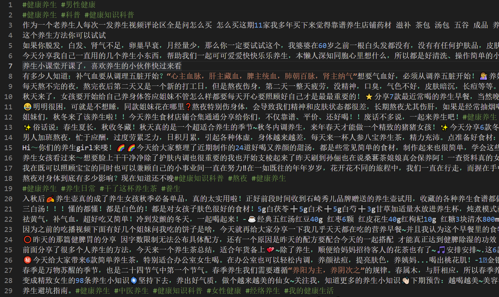
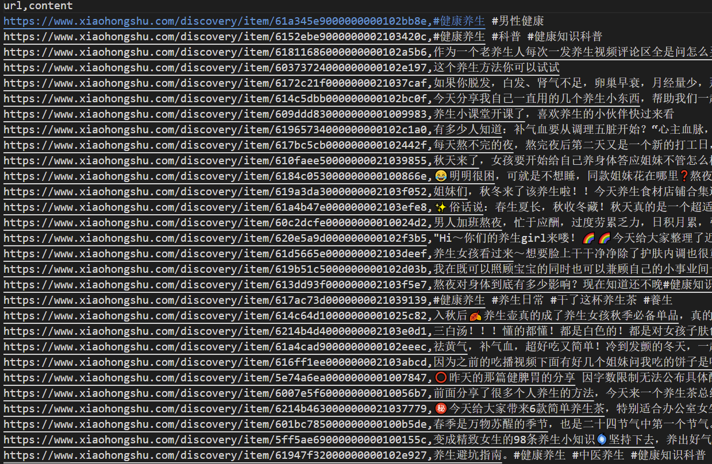

# 小红书自动爬取
自动爬取小红书文章/视频,可自定义爬取内容(标题/正文/评论/回复)

## 效果展示:






## 依赖:
- 下载python包依赖
  ```shell
  pip install -r requirements.txt
  ```
- 安装谷歌浏览器和谷歌浏览器驱动,并配置环境变量<br>
  [安装教程](https://www.cnblogs.com/lfri/p/10542797.html)<br>
  check your Google browser's version, choose the closest version and download corresponding GoogleDriver from [position1](http://chromedriver.storage.googleapis.com/index.html) or [position2](https://npm.taobao.org/mirrors/chromedriver/).And then move `chromedriver.exe` under `C:\Program Files\Google\Chrome\Application` and the same folder with your python explainer. Then add `C:\Program Files\Google\Chrome\Application` to your `system path`.

- 安装fiddler抓包工具
  - [fiddler安装教程1](https://blog.csdn.net/ychgyyn/article/details/82154433)
  - [fiddler安装教程2](https://www.cnblogs.com/katyhudson/p/12517680.html)
  - **如果使用时界面频繁出现黄色警告 `the system proxy was changed` ,需要检查并删除更改代理的应用**
    - 火狐浏览器插件->银联(删除)
    - easyconnect(删除)
    - 关闭其他代理软件(懂的都懂)
  > 目前笔者手机(华为p30)连接尚未成功,可以连接http/https但是部分应用无法联网,诸多解决办法均已尝试但仍然失败,如果有人成功请务必与我联系,本项目不需手机连接

## 使用方法:
- [视频介绍](https://github.com/learner-lu/xiaohongshu-spider/releases/download/v0.0.1/2022-03-13.17-53-57.mkv) **如需使用务必观看,以及可能会出现的问题**
- 文字介绍
  - 打开fiddler(保证底部导航栏有图标),设置filters->show only the following host->`t.xiaohongshu.com`
  - 电脑端打开微信小程序小红书(保证底部导航栏有图标)
  - 点击fiddler->file->save->select sessions->as text: 选择默认保存路径为该项目的data文件夹下(./data)
  - 如果使用的代码编辑器不是vscode,需要重新截图保存,见main.py 33行
  - 基本用法: 默认爬取 `藕粉 养生 代餐`的相关信息
    ```python
    python main.py
    ```
  - 参数介绍
    - 加入搜索的内容,使用空格分隔
      ```python
      python main.py 樱花 小鸟 鱼
      ```
    - `--target`: 修改匹配数量,默认100个(小红书小程序搜索上限),可以调低
      ```python
      python main.py 程序员 --target 30
      ```
    - `--keep`: 因为某些特殊原因小红书搜索过程中强行中断(ctrl+c)后接着之前的位置继续搜索(不建议使用)
    - `--config`: 配置文件的位置(不建议更改)
    - `--reset`: 重置配置文件

## 学习资料
- [pyautogui教程](https://blog.csdn.net/weixin_43430036/article/details/84650938)
- [pyautogui官网](https://pyautogui.readthedocs.io/en/latest/)
- [fiddler高级用法](https://blog.csdn.net/qq_36447759/article/details/83619944)